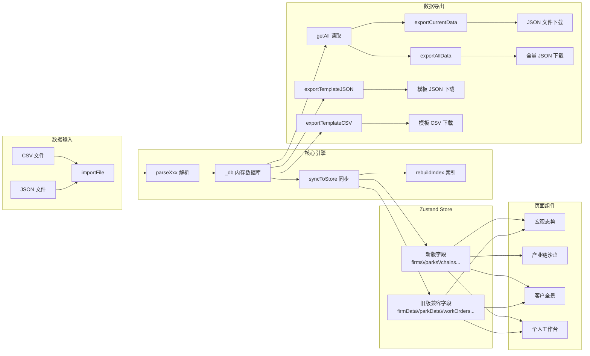

# BattleMap 作战地图 — 产品需求文档（PRD）

> 版本：v2.0.1 | 日期：2026-04-14 | 状态：Demo 完善版

---

## 一、产品概述

### 1.1 产品定位

BattleMap（作战地图）是一个面向金融租赁行业的 **产业客户作战指挥平台**。平台以「数据驱动决策」为核心，将分散的产业、企业、客户数据整合为可视化的作战视图，帮助客户经理和运营团队快速识别商机、评估风险、执行闭环工单。

### 1.2 目标用户

| 用户角色 | 典型行为 |
|---------|---------|
| 客户经理 | 执行工单、记录拜访、管理客户关系、提交数据补录 |
| 团队负责人 | 分配工单、查看团队负载、审批补录、发现商机 |
| 运营分析人员 | 查看宏观产业态势、分析园区指标、对标客户雷达 |
| 风控人员 | 监控企业风险预警、查看产融错配、追踪不良率 |

### 1.3 核心价值

- **全局视野**：一张地图看清全国产业格局和园区分布
- **商机发现**：AI 辅助识别高价值客户和扩张融资需求
- **执行闭环**：工单派发→执行→跟进全链路管理
- **数据联动**：导入数据后所有视图实时同步更新

---

## 二、产品结构

### 2.1 功能地图

```
BattleMap 作战地图
├── 宏观态势（/）
│     ├── 全国热力地图（按指标着色）
│     ├── 多园区指标对比散点图
│     ├── 产业供应链流线图
│     └── 人力布局桑基图
│
├── 产业链沙盘（/chain）
│     ├── 动力电池产业链树形图
│     ├── 力导向企业关系图谱
│     ├── 产业链融资结构雷达图
│     └── 园区-节点关联分析
│
├── 客户全景（/customer）
│     ├── 负债结构旭日图
│     ├── 六维雷达对标图
│     ├── IoT/数智指标时序图
│     └── 客户触达关系路径图
│
├── 个人工作台（/tasks）
│     ├── 工单管理（待办/已办/分配）
│     ├── 商机发现
│     ├── 客户检索
│     ├── 任务分发
│     └── 数据录入（数据补录 Tab）
│
└── 规则配置（/rules）
      ├── 数据字段目录库
      └── 业务规则策略画布
```

### 2.2 数据管理入口

- **统一入口**：`个人工作台` → `数据补录` → Tab1「数据录入」
- **支持 17 种数据类型**：行政区划 / 行业 / 产业链 / 园区 / 企业 / 工单 / 商机等

---

## 三、功能规格

### 3.1 宏观态势面板（`/`）

#### 3.1.1 全国热力地图

**功能描述**：基于 ECharts Geo 的全国行政区热力地图，支持按指标（投放/融资租赁/活力指数等）着色，支持省份高亮和缩放。

**关键交互**：
- 指标切换下拉（14 种指标）
- 省份点击高亮（视觉强调 + 联动其他图表）
- 鼠标滚轮缩放（roam: true），拖拽平移
- 工具提示（Tooltip）显示省份名 + 指标值

**数据来源**：`adminData`（行政区指标）+ `provinceCenters`（省份坐标）

#### 3.1.2 园区散点地图

**功能描述**：全国产业园区在地图上的地理位置散点图，园区大小按资产规模/企业数映射，支持脉冲动画。

**关键交互**：
- 散点大小映射：`在园企业数` 或 `全量融资`
- 点击园区 → 展开信息卡片
- 飞线动画：从武进经开区到其他目标城市的连接线
- 颜色编码：按 `risk`（low/yellow/high）着色

#### 3.1.3 产业供应链流线图

**功能描述**：展示全国新能源产业链（锂电/光伏/整车）的流向关系。

#### 3.1.4 人力布局桑基图

**功能描述**：客户经理的区域覆盖和客户分配关系。

---

### 3.2 产业链沙盘（`/chain`）

#### 3.2.1 动力电池产业链树形图

**功能描述**：动力电池产业链的上下游层级结构树，按 stage 分组（上游/中游/下游/终端）。

**数据来源**：`chainNodes`（节点信息）+ `chains`（产业链信息）

#### 3.2.2 力导向企业关系图谱

**功能描述**：ECharts 力导向图，展示节点内企业的关联关系（股权/担保/上下游）。

#### 3.2.3 产业链融资结构分析

**功能描述**：各环节融资结构对比（银行贷款/融资租赁/债券/其他）。

#### 3.2.4 园区-节点关联分析

**功能描述**：园区与产业链节点的归属关系视图。

---

### 3.3 客户全景（`/customer`）

#### 3.3.1 客户选择器

**功能描述**：左侧企业列表，支持搜索过滤。

**数据来源**：`customerSearchItems`（客户检索结果项）

#### 3.3.2 负债结构旭日图

**功能描述**：ECharts Sunburst，展示客户负债结构（银行/租赁/债券/其他）。

**数据来源**：`Firm.indicators`

#### 3.3.3 六维雷达对标图

**功能描述**：6 维度综合评分雷达图（资产规模/营收/增速/信用/担保/关系紧密度）。

#### 3.3.4 IoT/数智指标时序图

**功能描述**：ECharts 折线图，展示用电量、开工率、活力指数等指标的时间趋势。

#### 3.3.5 资信报告卡片

**功能描述**：信用评分、不良率、授信余额等关键指标卡片。

#### 3.3.6 客户触达关系路径图

**功能描述**：从客户经理到目标企业的多层关系网络（直接/同园/同链/协会）。

**数据来源**：`firmRelations` + `chainNodeDetails`

---

### 3.4 个人工作台（`/tasks`）

#### 3.4.1 工单管理

**功能描述**：客户经理的工单任务列表，支持按类型（排雷/关注/拓客）和状态（待闭环/进行中/已完成）过滤。

**数据来源**：`workOrders`

**Tab 导航**：
| Tab | 筛选条件 | 数据源 |
|-----|---------|--------|
| 我的待办 | `owner === CURRENT_USER && status !== 已完成` | `workOrders` |
| 全部任务 | 无过滤 | `workOrders` |
| 我的已办 | `owner === CURRENT_USER && status === 已完成` | `workOrders` |
| 我的分配 | `creator === CURRENT_USER` | `workOrders` |

**工单类型**：
- 排雷工单（红色，优先级最高，需 LBS 打卡）
- 关注工单（黄色，中优先级）
- 拓客工单（绿色，低优先级）

**任务卡片元素**：类型标签 / 标题 / 工单 ID / 状态图标 / 企业名 / 限期 / 创建人/执行人

#### 3.4.2 跟进详情面板

点击工单卡片 → 右侧滑出跟进详情面板：
- 工单基本信息（标题/类型/企业/限期/状态）
- 跟进时间线（`followRecords` 按 firmId 索引）
- 新增跟进记录输入框

#### 3.4.3 任务分发

**功能描述**：新建工单并指派给团队成员。

**表单字段**：任务类型 / 目标客户 / 执行人 / 完成期限 / 任务说明 / LBS 打卡 / 拍照上传 / 强制24h闭环

**辅助信息**：团队负载进度条（可视化团队成员当前任务数）

#### 3.4.4 商机发现

**功能描述**：AI 识别的业务机会列表，含价值评分和行动建议。

**数据来源**：`opportunities`

**卡片元素**：标题 / 描述 / 评分 / 金额 / 行动建议 / 生成工单按钮

#### 3.4.5 客户检索

**功能描述**：全局企业搜索，支持按名称/园区/行业过滤。

**数据来源**：`customerSearchItems`

**结果字段**：企业名 / 评级 / 园区 / 行业 / VI指数 / 风险状态

#### 3.4.6 数据录入（数据补录 Tab1）

**功能描述**：个人工作台「数据补录」入口的默认 Tab，提供 17 种数据类型的批量导入/导出。

**布局**：左侧类型选择器 + 右侧详情面板

**左侧类型选择器**：
- 6 个分组（行政区划 / 行业与产业 / 核心实体 / 关系数据 / 事件记录 / 指标数据）
- 每个类型显示：标签 / 当前条数 / 来源标签（已导入/示例数据）
- 搜索过滤 / 分组折叠展开

**右侧详情面板**：
- 顶部：类型名称 / 分组 / 来源 / 条数 / 最近导入时间
- CSV 必需列说明
- 文件上传区（拖放 + 点击上传，支持 .json 和 .csv）
- 操作按钮：JSON 模板下载 / CSV 模板下载 / 导出当前数据 / 恢复示例数据
- 底部：批量导入说明（规则/关联/顺序/联动/备份提示）
- 底部：变更记录（该类型的最近导入日志）

**全量导出**：左侧底部「导出全量数据」按钮，下载包含所有类型的 JSON 文件

**数据联动**：导入数据后，`宏观态势` / `产业链沙盘` / `客户全景` / `个人工作台` 所有视图实时同步更新

#### 3.4.7 发起补录（数据补录 Tab2）

**功能描述**：字段级变更补录，提交后记录变更历史。

**表单**：补录类型（新增/更新/删除）/ 目标企业（select）/ 字段变更（字段名/旧值→新值，支持多行）/ 提交按钮

**补录历史**：Tab3 展示本人所有补录记录，含变更摘要和生效状态

---

### 3.5 规则配置（`/rules`）

#### 3.5.1 数据目录库

**功能描述**：系统中可用数据字段的元信息目录。

**数据来源**：`dataFields`

**字段信息**：KEY / 业务名称 / 格式 / 数据来源 / 描述

#### 3.5.2 业务规则策略画布

**功能描述**：可视化规则编辑，支持 AND/OR 条件节点编排。

**数据来源**：`businessRules`

**规则元素**：触发条件 / 精度 / 条件列表 / 命中动作

---

## 四、数据模型

### 4.1 数据类型总表（17 种对象类型）

| objectType | 中文名 | 分组 | 关键字段 | 联动页面 |
|-----------|-------|------|---------|---------|
| `province` | 省份 | 行政区划 | id/code/name/lng/lat | 宏观地图 |
| `city` | 城市 | 行政区划 | id/code/name/provinceId | 宏观地图 |
| `district` | 区县 | 行政区划 | id/code/name/cityId/provinceId | 宏观地图 |
| `street` | 街道/园区 | 行政区划 | id/name/districtId/坐标 | 宏观地图 |
| `industry` | 一级行业 | 行业与产业 | id/name/color/subIndustries | 产业链/园区 |
| `sub_industry` | 子行业 | 行业与产业 | id/name/industryId | 产业链/企业 |
| `chain` | 产业链 | 行业与产业 | id/name/status/description | 产业链沙盘 |
| `chain_node` | 产业链节点 | 行业与产业 | id/chainId/name/stage/scale/activity/bankRatio/leaseRatio | 产业链沙盘 |
| `park` | 园区 | 核心实体 | id/name/城市/坐标/risk/行业/chainIds/园区指标/firmIds | 宏观/产业链/客户 |
| `manager` | 客户经理 | 核心实体 | id/name/role/department/area/email/leaderId/工单数/商机数/拜访数 | 工作台 |
| `firm` | 企业 | 核心实体 | id/name/fullName/creditCode/parkIds/行业/chainNodeIds/rating/risk/asset/revenue/indicators | 全部页面 |
| `executive` | 企业高管 | 关系数据 | id/firmId/name/title/phone/isLegalRep | 客户全景 |
| `firm_relation` | 企业关系 | 关系数据 | id/sourceId/targetId/type/description/strength | 客户全景/产业链 |
| `visit_record` | 拜访记录 | 事件记录 | id/targetType/targetId/managerId/visitType/visitDate/location/summary | 工作台 |
| `work_order` | 工单 | 事件记录 | id/type/level/title/firmId/ownerId/creatorId/deadline/status | 工作台 |
| `opportunity` | 商机 | 事件记录 | id/title/level/firmId/product/amount/irr/probability/ownerId | 工作台 |
| `plan` | 投放计划 | 事件记录 | id/title/product/firmId/targetAmount/milestones/ownerId | 工作台 |
| `admin_data` | 行政区指标 | 指标数据 | Record<MetricKey, Record<ProvinceName, number>> | 宏观态势 |

### 4.2 核心数据类型

#### Firm（企业）

```typescript
interface Firm {
  id: string;                          // 唯一标识
  name: string;                        // 简称
  fullName: string;                    // 全称
  creditCode: string;                  // 统一社会信用代码
  parkIds: string[];                   // 所属园区 ID 列表
  locationIds: string[];               // 经营地址 ID 列表
  industryIds: string[];               // 行业 ID 列表
  subIndustryIds: string[];            // 子行业 ID 列表
  chainNodeIds: string[];              // 关联产业链节点 ID 列表
  rating: CreditRating;                // 信用评级（AAA/AA+/AA/...）
  risk: FirmStatus;                    // 风险状态（normal/warning/danger）
  scale: FirmScale;                    // 规模（大型/中型/小型）
  asset: string;                       // 资产规模描述（如"50亿"）
  revenue: string;                     // 年营收描述
  establishedYear: string;             // 成立年份
  website?: string;
  phone?: string;
  primaryManagerId?: string;           // 主客户经理 ID
  coManagerIds?: string[];             // 协同经理 ID 列表
  indicators: FirmIndicator;           // 经营指标
  creatorId?: string;
  status: 'normal' | 'abnormal';
  createdAt: string;
  updatedAt: string;
}
```

#### Park（园区）

```typescript
interface Park {
  id: string;
  name: string;
  cityId: string;
  districtId: string;
  streetId: string;
  lng: number;
  lat: number;
  risk: 'low' | 'medium' | 'high';
  scale: string;              // 园区级别（如"国家级经开区"）
  industries: string[];        // 园区主导产业 ID 列表
  chainIds: string[];         // 园区关联产业链 ID 列表
  data: Record<MetricKey, number>;  // 园区运营指标
  firmIds: string[];          // 园区内企业 ID 列表
  status: 'active' | 'inactive';
  establishedYear: string;
}
```

#### WorkOrder（工单）

```typescript
interface WorkOrder {
  id: string;                  // 工单号（格式：WO-YYYY-NNNN）
  type: '排雷' | '关注' | '拓客';
  level?: 'red' | 'yellow' | 'green';
  title: string;
  desc?: string;
  firmId?: string;
  firmName?: string;
  parkId?: string;
  parkName?: string;
  ownerId: string;            // 执行人 ID
  ownerName?: string;
  creatorId: string;          // 创建人 ID
  creatorName?: string;
  deadline: string;           // 期限（YYYY-MM-DD）
  status: '待闭环' | '进行中' | '已完成';
  lbsRequired?: boolean;      // 是否需要 LBS 打卡
  lbsVerified?: boolean;
  completedAt?: string;
  relatedVisitId?: string;
  priority?: number;
  createdAt: string;
  updatedAt: string;
}
```

#### Opportunity（商机）

```typescript
interface Opportunity {
  id: string;                  // 商机编号（格式：OPP-YYYY-NNNN）
  title: string;
  level: 'high' | 'medium' | 'low';  // 价值等级
  source: string;             // 来源（如"数据补录"）
  desc: string;               // 商机描述
  firmId: string;
  firmName: string;
  parkId: string;
  product: '直接租赁' | '售后回租' | '经营租赁';
  amount: string;             // 估算金额（如"5000万"）
  irr?: string;               // 内部收益率
  term?: string;              // 期限
  probability: number;        // 成交概率 0-100
  action: string;             // 当前行动建议
  nextActionDate: string;
  ownerId: string;
  ownerName: string;
  status: '待跟进' | '跟进中' | '已成交' | '已放弃';
  createdAt: string;
  updatedAt: string;
  closedAt?: string;
  closedReason?: string;
}
```

### 4.3 指标定义（14 种）

```typescript
type MetricKey =
  | '投放'       // 我司设备投放规模（亿元）
  | '融资租赁'   // 融资租赁余额（亿元）
  | '企业贷款'   // 企业贷款余额（亿元）
  | '全量融资'   // 全量融资规模（亿元）
  | '活力指数'   // 园区活力指数（0-100）
  | '开工率'     // 产能利用率（%）
  | '金租渗透率' // 融资租赁渗透率（%）
  | '用电增速'   // 用电量同比增速（%）
  | '设备投放'   // 新增设备投放（台套）
  | '客户数'     // 管户客户数
  | '不良率'     // 不良贷款率（%）
  | '在园企业数' // 园区内注册企业数
  | '当年新注册' // 当年新注册企业数
  | '高新技术占比' // 高新技术企业占比（%）
```

### 4.4 企业关系类型（8 种）

```typescript
type FirmRelationType =
  | 'upstream'      // 上游供应
  | 'downstream'    // 下游采购
  | 'same_park'     // 同园区
  | 'same_chain'    // 同产业链
  | 'equity'        // 股权投资
  | 'guarantee'     // 担保关系
  | 'association'    // 协会成员
  | 'other'         // 其他关系
```

---

## 五、技术架构

### 5.1 技术栈

| 层级 | 技术选型 | 版本 |
|------|---------|------|
| UI 框架 | React | 18.x |
| 语言 | TypeScript | 5.x |
| 路由 | react-router-dom | v6 |
| 状态管理 | Zustand | latest |
| 样式 | Tailwind CSS + CSS 变量 | — |
| 图表 | ECharts | 5.x |
| 地图 | ECharts Geo + GeoJSON | — |
| 图标 | lucide-react | — |
| 构建 | Vite | 8.x |
| 包管理 | npm | — |

### 5.2 目录结构

```
frontend/src/
├── App.tsx                    # 路由注册 + Toast 容器
├── index.css                 # 全局样式 + CSS 变量（主题系统）
│
├── components/
│   ├── Layout/
│   │     ├── AppLayout.tsx   # 根布局（Sidebar + Outlet）
│   │     └── Sidebar.tsx     # 侧边导航栏（5项 NavLink）
│   ├── Dashboard/
│   │     ├── Header.tsx      # 顶部状态栏（数字动画）
│   │     ├── LeftPanel.tsx    # 左侧控制面板
│   │     ├── RightPanel.tsx   # 右侧信息面板
│   │     └── BottomBar.tsx    # 底部状态条
│   ├── Map/
│   │     └── ChinaMap.tsx     # 全国园区散点+飞线地图
│   ├── Robot/
│   │     ├── FloatingRobot.tsx  # AI 入口（float/inline 两种模式）
│   │     └── RobotChat.tsx       # AI 对话窗口
│   └── CustomerView/
│         └── CustomerRelationPanel.tsx  # 客户关系图谱
│
├── pages/
│   ├── MacroPanel.tsx          # 宏观态势（/）
│   ├── IndustryChain.tsx       # 产业链沙盘（/chain）
│   ├── CustomerView.tsx        # 客户全景（/customer）
│   ├── TaskCenter.tsx           # 个人工作台（/tasks）
│   ├── RuleConfig.tsx           # 规则配置（/rules）
│   └── TaskDataImport.tsx       # 数据录入面板组件（工作台嵌入）
│
├── data/
│   ├── types.ts                # 全量 TypeScript 类型定义（v2.0）
│   ├── importer.ts              # v2.0 导入引擎（_db + syncToStore）
│   ├── exporter.ts              # v2.0 导出引擎（模板/当前/全量）
│   ├── mockData.ts              # 旧版入口代理层（向后兼容）
│   ├── mockDataV2.ts            # v2.0 示例数据（17 类约 150+ 条）
│   ├── dataIndex.ts             # 索引构建 + 跨模块查询函数
│   ├── firmData.ts              # 旧版企业数据
│   ├── parkData.ts              # 旧版园区数据
│   ├── chainData.ts             # 旧版产业链数据
│   ├── teamData.ts              # 旧版团队成员数据
│   ├── workOrderData.ts         # 旧版工单数据
│   ├── opportunityData.ts       # 旧版商机数据
│   ├── customerData.ts          # 旧版客户全景数据
│   ├── metricData.ts            # 旧版指标数据
│   ├── ruleData.ts              # 旧版规则数据
│   ├── followData.ts            # 旧版跟进记录
│   ├── supplementData.ts        # 补录记录
│   ├── dailyPushData.ts         # 每日推送记录
│   ├── geoLoader.ts             # 省份 GeoJSON 按需加载器
│   ├── robotData.ts             # AI 机器人配置
│   ├── relationLinkData.ts      # 企业关系链路数据
│   ├── importers.ts             # 旧版 CSV 解析器
│   └── geo/                     # 各省份 GeoJSON 文件（约 30+ 个）
│         ├── 320000.json         # 江苏省
│         ├── 440000.json         # 广东省
│         └── ...
│
├── store/
│   ├── data.ts                  # Zustand 全局数据状态
│   └── toast.ts                  # Toast 通知状态
│
├── hooks/
│   └── useChartTheme.ts         # ECharts 主题配色 hook
│
└── services/
    └── apiService.ts             # API 服务层
```

### 5.3 数据流转架构



---

## 六、UI 设计规范

### 6.1 主题系统

采用 CSS 变量驱动的双主题系统（暗色/亮色），通过 `store/theme.ts` 切换。

**暗色主题（默认）**：

```css
--c-bg: #040B16;           /* 页面背景 */
--c-bg-elevated: #060E1A;  /* 抬升面 */
--c-surface: rgba(10,26,47,0.85);  /* 玻璃态面板 */
--c-border: rgba(30,64,112,0.45);   /* 边框 */
--c-text: #F0F4F8;          /* 主文字 */
--c-text-secondary: #94A3B8; /* 次级文字 */
--c-text-muted: #475569;    /* 弱化文字 */
--c-accent: #3B82F6;        /* 主色调（蓝）*/
--c-accent-glow: rgba(59,130,246,0.4);  /* 发光 */
--c-green: #00E676;         /* 绿色（成功/中游）*/
--c-red: #FF4D4F;           /* 红色（风险）*/
--c-yellow: #FAAD14;        /* 黄色（关注）*/
--c-map-area: #0B1D3A;      /* 地图区域 */
--c-map-area2: #0A1628;     /* 地图区域2 */
--c-map-border: #1A3A6A;   /* 地图边框 */
```

### 6.2 组件样式规范

**tech-panel（玻璃态面板）**：
```css
backdrop-filter: blur(12px);
background: rgba(10,26,47,0.85);
border: 1px solid rgba(30,64,112,0.45);
border-radius: 12px;
box-shadow: 0 4px 24px rgba(0,0,0,0.4);
```

**tech-title（渐变标题）**：
```css
background: linear-gradient(to right, var(--c-accent), #67e8f9);
-webkit-background-clip: text;
-webkit-text-fill-color: transparent;
```

### 6.3 字号规范

| 级别 | 字号 | 用途 | CSS 类 |
|-----|------|------|--------|
| 页面标题 | 18px | 页面大标题 | `text-lg` |
| 卡片标题 | 14px | 面板/卡片标题 | `text-sm` |
| 正文 | 12px | 正文内容 | `text-xs` |
| 标签 | 10px | 标签/徽章 | `text-[10px]` |
| 辅助说明 | 9px | 说明文字/时间戳 | `text-[9px]` |
| 极小 | 8px | 计数/次要标签 | `text-[8px]` |

### 6.4 图表配色

由 `hooks/useChartTheme.ts` 的 `useChartTheme()` hook 统一管理，返回适配当前主题的 ECharts 配色对象。

### 6.5 图标规范

使用 `lucide-react` 图标库，主流尺寸：
- 导航/标题：`w-5 h-5`（20px）
- 卡片内：`w-4 h-4`（16px）
- 标签/状态：`w-3.5 h-3.5`（14px）
- 辅助/时间：`w-3 h-3`（12px）
- 极小装饰：`w-2.5 h-2.5`（10px）

---

## 七、非功能需求

### 7.1 性能

- 首屏加载：GeoJSON 按省份懒加载，首屏仅加载全国底图
- ECharts 图表：ResizeObserver 监听容器变化自动 resize
- 大数据量：虚拟列表（如果单类型数据 > 1000 条需考虑）
- 图片/媒体：无（纯数据可视化产品）

### 7.2 兼容性

- 目标浏览器：Chrome/Edge 最新版
- 响应式：最小支持 1280px 宽度（桌面端产品）

### 7.3 可访问性

- 所有交互元素有键盘支持
- 图表工具提示支持屏幕阅读器
- 颜色对比度符合 WCAG AA 标准

### 7.4 国际化

- 当前版本：仅支持中文
- 如需国际化：将硬编码中文文本抽取到 `i18n/` 资源文件

---

## 八、版本记录

| 版本 | 日期 | 变更 |
|------|------|------|
| v2.0.1 | 2026-04-14 | Demo 完善版：修复 TaskCenter useState 缺失、Supplement 类型断言错误、数据补录入口缺失 |
| v2.0 | 2026-04-13 | 重大重构：新增数据导入引擎、合并数据管理入口至个人工作台、v2.0 数据模型（18 种对象类型） |
| v1.x | 2026-03 | 初始版本：5 个页面 + 旧版 mock 数据 |
